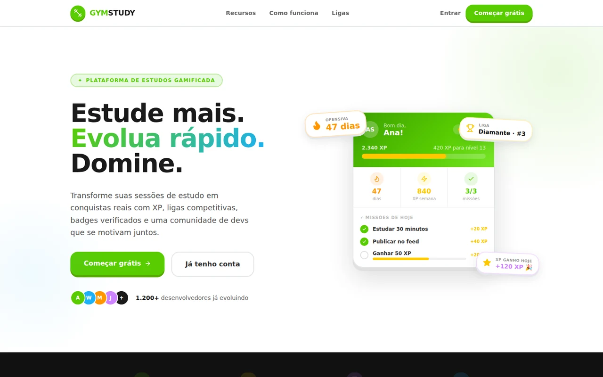
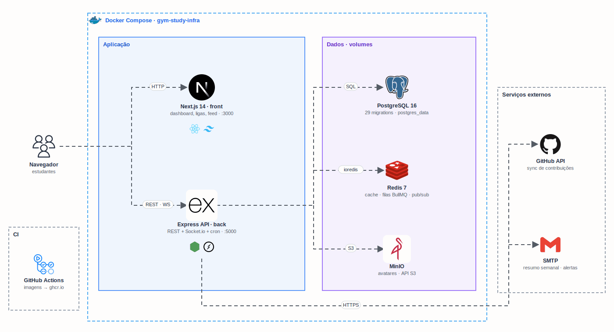

<h1 align="center">
  Gym Study · Front
</h1>

<p align="center">
  
</p>

<p align="center">
  <a href="https://skillicons.dev">
    
  </a>
</p>

## Qual a finalidade do projeto?

Web app do **Gym Study**, uma plataforma de estudos gamificada, no estilo Duolingo, para quem estuda tecnologia. Cada sessão de estudo registrada vira **XP**, mantém a **ofensiva** (dias seguidos estudando), sobe o nível dos **badges** e coloca o estudante nas **ligas semanais**, de Bronze a Diamante.

A ideia é transformar o estudo em hábito com competição saudável. Os amigos aparecem no **ranking**, o **feed** mostra o progresso da comunidade e as **missões do dia** dão um objetivo curto para cada dia.

Os dados vêm da API do [gym-study-back](https://github.com/gym-study-org/gym-study-back), por REST e WebSocket.

## Arquitetura

<p align="center">
  
</p>

## O que foi construído

### Páginas

| Rota | Descrição |
|---|---|
| `/` | Landing page |
| `/login`, `/register` | Autenticação (JWT) |
| `/dashboard` | Resumo do dia: ofensiva, XP, nível, missões e atalhos |
| `/study` | Timer de estudo e sessões recentes |
| `/stats` | Horas por assunto e distribuição do tempo (gráficos) |
| `/goals` | Metas de estudo com progresso |
| `/certifications` | Certificações conquistadas |
| `/ranking` | Ranking global, entre amigos, mensal e semanal |
| `/leagues` | Liga da semana, com zona de promoção |
| `/feed` | Posts, stories e compartilhamento de conquistas |
| `/friends` | Busca, pedidos e lista de amigos |
| `/achievements`, `/badges` | Conquistas e badges com níveis |
| `/challenges`, `/groups` | Desafios entre amigos e grupos de estudo |
| `/shop` | Loja de gems (freeze de ofensiva, badges cosméticos) |
| `/articles` | Artigos escritos pela comunidade |
| `/profile/[username]` | Perfil com horas estudadas, badges e certificações |

### Integrações

| Integração | Uso |
|---|---|
| API REST (`NEXT_PUBLIC_API_URL`) | Todos os dados, via Axios com token JWT |
| Socket.io (`NEXT_PUBLIC_WS_URL`) | Notificações e atualizações em tempo real |

## Tecnologias utilizadas

- **Next.js 14 + React 18:** App Router, build `standalone` para Docker;
- **TypeScript:** tipagem de todo o código;
- **Tailwind CSS + Radix UI:** componentes acessíveis no estilo shadcn/ui;
- **Zustand:** estado global (sessão do usuário);
- **React Hook Form + Zod:** formulários com validação;
- **Recharts:** gráficos de estatísticas;
- **Socket.io Client:** tempo real;
- **Docker:** imagem de produção em duas etapas (Node 20 Alpine);
- **GitHub Actions:** build da imagem e publicação no GitHub Container Registry.

## Estrutura do repositório

```text
gym-study-front/
├── src/
│   ├── app/(auth)/            # Login e cadastro
│   ├── app/(dashboard)/       # Páginas logadas (dashboard, ligas, feed…)
│   ├── components/            # Componentes por domínio + ui/ (Radix)
│   ├── lib/api/               # Um cliente por módulo da API
│   ├── hooks/useSocket.ts     # Conexão Socket.io
│   └── store/                 # Zustand
├── docs/
│   ├── demo.webp              # Demonstração do app
│   └── arch.gif               # Diagrama da arquitetura
├── .github/workflows/ci-cd.yml
├── Dockerfile
└── README.md
```

## Fluxo de funcionamento

1. O estudante cria a conta ou faz login; a API devolve um JWT, guardado no store.
2. No `/study`, ele inicia o timer; ao parar, o front envia `POST /api/study-sessions`.
3. A API soma as horas, atualiza a ofensiva e concede XP em segundo plano (filas BullMQ).
4. Dashboard, ligas e ranking mostram o novo XP e a nova posição.
5. Conquistas e badges desbloqueados chegam como notificação pelo Socket.io.
6. O estudante compartilha o progresso no feed e acompanha os amigos.

## Como rodar

O jeito mais simples é subir a stack inteira pelo [gym-study-infra](https://github.com/gym-study-org/gym-study-infra), com front, API, banco, Redis e MinIO.

Só o front, apontando para uma API já rodando:

```bash
cp .env.local.example .env.local   # NEXT_PUBLIC_API_URL e NEXT_PUBLIC_WS_URL
npm install
npm run dev
# http://localhost:3000
```

Para ter dados de exemplo, rode `node scripts/seed-demo.mjs` no back e entre com `ana@gymstudy.dev` / `Demo1234`.

## Como validar a entrega

Em uma validação end-to-end, o estudante deve registrar uma sessão de estudo e ver o XP, a liga e o ranking mudarem.

Pontos principais de validação:

- cadastro e login funcionando;
- timer do `/study` registrando a sessão ao parar;
- `/stats` com os gráficos de horas por assunto;
- `/leagues` e `/ranking` refletindo o XP da semana;
- `/badges` e `/achievements` mostrando o progresso;
- feed carregando os posts dos amigos;
- `docker build` gerando a imagem de produção.

## Projeto Gym Study

| Repositório | Camada |
|---|---|
| **gym-study-front** | Web app (Next.js) |
| [gym-study-back](https://github.com/gym-study-org/gym-study-back) | API (Express + PostgreSQL + Redis) |
| [gym-study-infra](https://github.com/gym-study-org/gym-study-infra) | Stack completa com Docker Compose |

## Autor

**William Alves Coelho** · [@willtechdev](https://github.com/willtechdev)
